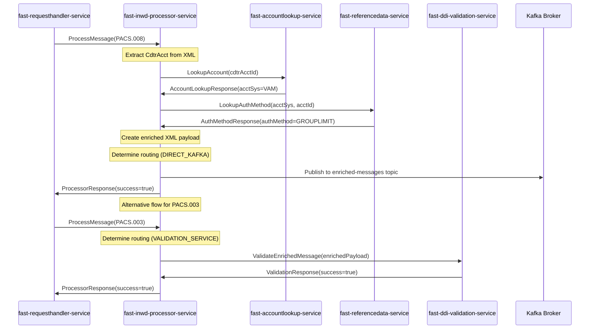
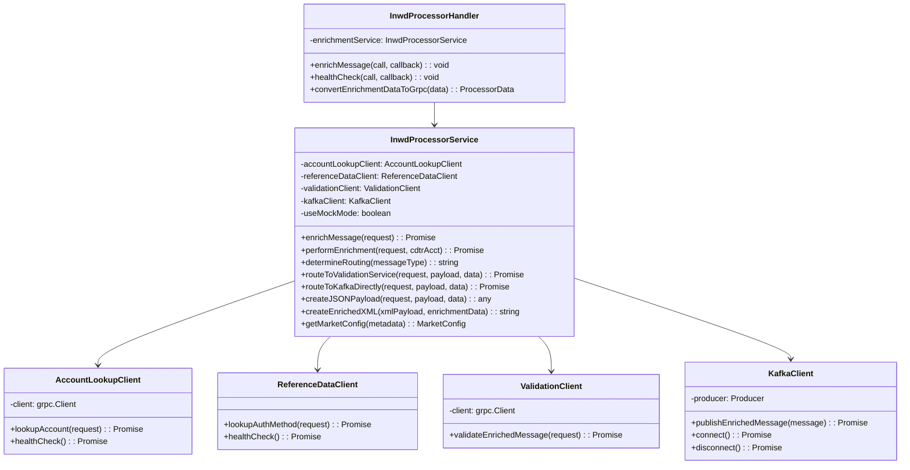

# Fast Inward Processor Service - Design Document

## Overview

The **Fast Inward Processor Service** is the central orchestration hub of the Singapore G3 Payment Platform. It coordinates account lookup, reference data retrieval, and message enrichment for inward payment processing. This gRPC service serves as the primary integration point between multiple services and implements intelligent routing based on message types.

### Key Responsibilities
- Orchestrate account lookup and reference data retrieval
- Enrich PACS messages with account information and authentication methods
- Implement intelligent routing (PACS.003 → Validation, PACS.008/007 → Direct Kafka)
- Coordinate with multiple downstream services
- Manage message transformation and enrichment workflows

### Service Details
- **Service Type**: gRPC Service (Central Hub)
- **Port**: 50052
- **Package**: `gpp.g3.inwdprocessor`
- **Technology Stack**: TypeScript, gRPC, Kafka
- **Role**: Central orchestration hub for message enrichment

---

## Sequence Diagram



---

## Class Diagram



---

## Request and Response Formats

### gRPC Service Definition

```protobuf
syntax = "proto3";

package gpp.g3.inwdprocessor;

service InwdProcessorService {
  rpc ProcessMessage(ProcessorRequest) returns (ProcessorResponse);
  rpc HealthCheck(HealthCheckRequest) returns (HealthCheckResponse);
}
```

### ProcessorRequest

```protobuf
message ProcessorRequest {
  string message_id = 1;          // UUID from request handler
  string puid = 2;                // G3I identifier
  string message_type = 3;        // PACS008, PACS007, PACS003, CAMT053, etc.
  string xml_payload = 4;         // The validated XML payload
  map<string, string> metadata = 5; // Additional context data (market info)
  int64 timestamp = 6;            // Original processing timestamp
}
```

### ProcessorResponse

```protobuf
message ProcessorResponse {
  string message_id = 1;               // Echo back the UUID
  string puid = 2;                     // Echo back the G3I identifier
  bool success = 3;                    // Whether processing was successful
  string enriched_payload = 4;         // The enriched XML payload
  string error_message = 5;            // Error details if success = false
  ProcessorData enrichment_data = 6;   // Enrichment data from account lookup
  int64 processed_at = 7;              // When processing completed
  string next_service = 8;             // Next service in pipeline
}
```

### ProcessorData (Enrichment Data)

```protobuf
message ProcessorData {
  string received_acct_id = 1;         // Original CdtrAcct ID
  int32 lookup_status_code = 2;        // 200 for success
  string lookup_status_desc = 3;       // Success description
  string normalized_acct_id = 4;       // Normalized account ID
  string matched_acct_id = 5;          // Matched account ID
  string partial_match = 6;            // Y or N
  string is_physical = 7;              // Y or N
  PhysicalAccountInfo physical_acct_info = 8; // Complex account information
  string auth_method = 9;              // Authentication method
}
```

### PhysicalAccountInfo

```protobuf
message PhysicalAccountInfo {
  string acct_id = 1;                  // Account ID
  string acct_sys = 2;                 // Account system (MDZ, VAM, MEPS, etc.)
  string acct_group = 3;               // Account group (varies by market)
  string country = 4;                  // Country code (SG, MY, TH, etc.)
  string branch_id = 5;                // Branch ID (nullable)
  AccountAttributes acct_attributes = 6;
  AccountOpsAttributes acct_ops_attributes = 7;
  string bicfi = 8;                    // Bank identifier (market-specific)
  string currency_code = 9;            // Currency code (SGD, MYR, THB, USD, EUR)
}
```

---

## Business Logic and Routing Rules

### Message Type Routing

| Message Type | Routing Decision | Destination |
|--------------|------------------|-------------|
| **PACS.003** | `VALIDATION_SERVICE` | fast-ddi-validation-service → Kafka |
| **PACS.008** | `DIRECT_KAFKA` | Direct to enriched-messages topic |
| **PACS.007** | `DIRECT_KAFKA` | Direct to enriched-messages topic |
| **Default** | `VALIDATION_SERVICE` | fast-ddi-validation-service → Kafka |

### Account System Detection

```typescript
// Account System Logic (via Account Lookup Service)
determineAccountSystem(accountId: string): string {
  // VAM accounts: accounts starting with 999 or containing VAM
  if (accountId.startsWith('999') || accountId.includes('VAM')) {
    return 'VAM';
  }
  // All other accounts use MDZ
  return 'MDZ';
}
```

### Authentication Method Rules

```typescript
// Authentication Method Logic (via Reference Data Service)
determineAuthMethod(accountId: string): string {
  if (accountId.startsWith('999') || accountId.startsWith('VAM')) {
    return 'GROUPLIMIT';  // VAM accounts require group limits
  }
  if (accountId.startsWith('888') || accountId.includes('CORP')) {
    return 'AFPTHENLIMIT'; // Corporate accounts
  }
  if (accountId.startsWith('777') || accountId.includes('PRIV')) {
    return 'AFPONLY';      // Private accounts
  }
  return 'AFPONLY';        // Default
}
```

---

## Enrichment Data Structure

### Complete Enrichment Response

```json
{
  "receivedAcctId": "999888777666",
  "lookupStatusCode": 200,
  "lookupStatusDesc": "Account lookup successful",
  "normalizedAcctId": "999888777666",
  "matchedAcctId": "999888777666",
  "partialMatch": "N",
  "isPhysical": "Y",
  "authMethod": "GROUPLIMIT",
  "physicalAcctInfo": {
    "acctId": "999888777666",
    "acctSys": "VAM",
    "acctGroup": "RETAIL",
    "country": "SG",
    "branchId": "001",
    "acctAttributes": {
      "acctType": "Physical",
      "acctCategory": "SAVINGS",
      "acctPurpose": "PERSONAL_BANKING"
    },
    "acctOpsAttributes": {
      "isActive": "Yes",
      "acctStatus": "Active",
      "openDate": "15/03/2020",
      "expiryDate": "31/12/2025",
      "restraints": {
        "stopAll": "N",
        "stopDebits": "N",
        "stopCredits": "N",
        "stopAtm": "N",
        "stopEftPos": "N",
        "stopUnknown": "N",
        "warnings": []
      }
    },
    "bicfi": "ANZBSG3MXXX",
    "currencyCode": "SGD"
  }
}
```

---

## Integration Patterns

### Service Integration Flow

```
1. Request Handler → Inward Processor (ProcessMessage)
2. Inward Processor → Account Lookup (LookupAccount)
3. Account Lookup → Inward Processor (EnrichmentData with acctSys)
4. Inward Processor → Reference Data (LookupAuthMethod)  
5. Reference Data → Inward Processor (AuthMethod)
6. Inward Processor → Create Enriched XML
7. Inward Processor → Route based on message type:
   - PACS.003 → Validation Service → Kafka
   - PACS.008/007 → Direct Kafka
```

### Kafka Topic Strategy

#### Topic: `enriched-messages` (PACS.008, PACS.007)

```json
{
  "messageId": "uuid",
  "puid": "G3I123456789",
  "messageType": "PACS.008",
  "jsonPayload": {
    "messageId": "uuid",
    "puid": "G3I123456789", 
    "messageType": "PACS.008",
    "enrichedXmlPayload": "enriched-xml-content",
    "enrichmentData": "enrichment-object",
    "extractedFields": {
      "cdtrAcct": "999888777666",
      "amount": "1000.00",
      "currency": "SGD", 
      "country": "SG"
    },
    "processedAt": "2024-01-01T10:00:00Z",
    "sourceService": "fast-enrichment-service"
  },
  "enrichmentData": "enrichment-object",
  "timestamp": 1640995200000,
  "sourceService": "fast-enrichment-service"
}
```

---

## Configuration

### Environment Variables

```bash
# gRPC Configuration
GRPC_PORT=50052
SERVICE_NAME=fast-inwd-processor-service

# Market Configuration
COUNTRY=SG
DEFAULT_CURRENCY=SGD
TIMEZONE=Asia/Singapore

# Downstream Service URLs
ACCOUNT_LOOKUP_SERVICE_URL=localhost:50059
REFERENCE_DATA_SERVICE_URL=localhost:50060
VALIDATION_SERVICE_URL=localhost:50053

# Kafka Configuration
KAFKA_BROKERS=localhost:9092
KAFKA_CLIENT_ID=fast-inwd-processor-service
ENRICHED_MESSAGES_TOPIC=enriched-messages

# Processing Configuration
LOOKUP_TIMEOUT_MS=3000
MAX_RETRY_ATTEMPTS=3
RETRY_BACKOFF_MS=1000
USE_MOCK_MODE=false

# Test Configuration
NODE_ENV=development
ENVIRONMENT=development
```

---

## Database Schema

**Note**: This service does not maintain persistent data storage. It operates as a stateless orchestration service that coordinates between multiple data sources.

### Mock Data Storage (Test Mode Only)

```typescript
interface MockAccountData {
  accountId: string;
  accountSystem: 'VAM' | 'MDZ' | 'MEPS';
  authMethod: 'GROUPLIMIT' | 'AFPTHENLIMIT' | 'AFPONLY';
  country: string;
  currency: string;
  isActive: boolean;
}
```

---

## Service Dependencies

### Required Services

| Service | Port | Purpose | Status |
|---------|------|---------|--------|
| **fast-accountlookup-service** | 50059 | Account information retrieval | Required |
| **fast-referencedata-service** | 50060 | Authentication method lookup | Required |
| **fast-ddi-validation-service** | 50053 | Message validation (PACS.003) | Required |
| **Kafka Broker** | 9092 | Message publishing (PACS.008/007) | Required |

### Optional Integrations

| Service | Port | Purpose | Fallback |
|---------|------|---------|----------|
| **Monitoring Service** | Various | Health and metrics | Local logging |
| **Configuration Service** | Various | Dynamic configuration | Environment variables |

---

## Error Handling

### Error Response Structure

```json
{
  "messageId": "uuid",
  "puid": "G3I123456789",
  "success": false,
  "errorMessage": "Account lookup failed: Service unavailable",
  "enrichmentData": null,
  "processedAt": 1640995200000,
  "nextService": "",
  "errorCode": "ACCOUNT_LOOKUP_ERROR",
  "errorDetails": {
    "service": "fast-accountlookup-service",
    "operation": "LookupAccount", 
    "cdtrAcctId": "123456789",
    "retryAttempts": 3,
    "lastError": "Connection timeout"
  }
}
```

### Error Categories

| Error Type | Code | Description | Recovery Action |
|------------|------|-------------|-----------------|
| **Account Lookup Errors** | `LOOKUP_ERROR` | Account service unavailable | Retry with exponential backoff |
| **Reference Data Errors** | `REFDATA_ERROR` | Auth method lookup failed | Use default auth method |
| **Validation Errors** | `VALIDATION_ERROR` | Validation service failed | Return error to client |
| **Kafka Errors** | `KAFKA_ERROR` | Publishing failed | Retry publishing |
| **XML Processing Errors** | `XML_ERROR` | Invalid XML structure | Return validation error |

---

## Performance Characteristics

### Service Performance Metrics
- **Average Response Time**: 150-300ms (including downstream calls)
- **Account Lookup Time**: ~110ms average
- **Reference Data Time**: ~50ms average  
- **XML Processing Time**: ~20ms average
- **Kafka Publishing Time**: ~30ms average

### Throughput Specifications
- **Target Throughput**: 1000+ messages per second
- **Concurrent Requests**: 100+ simultaneous
- **Resource Usage**: 512MB-1GB memory, moderate CPU

### SLA Requirements
- **Availability**: 99.9% uptime
- **Response Time**: 95th percentile < 500ms
- **Error Rate**: < 0.1% for valid requests

---

## Monitoring and Health Checks

### Health Check Implementation

```typescript
async healthCheck(): Promise<HealthCheckResponse> {
  const dependencies = await Promise.allSettled([
    this.accountLookupClient.healthCheck(),
    this.referenceDataClient.healthCheck(),
    this.kafkaClient.healthCheck()
  ]);
  
  const overallHealth = dependencies.every(d => d.status === 'fulfilled');
  
  return {
    status: overallHealth ? 'SERVING' : 'NOT_SERVING',
    message: overallHealth ? 'All dependencies healthy' : 'Some dependencies unhealthy',
    timestamp: Date.now(),
    dependencies: {
      accountLookup: dependencies[0].status,
      referenceData: dependencies[1].status, 
      kafka: dependencies[2].status
    }
  };
}
```

### Monitoring Metrics

- **Message Processing Rates**: By message type and routing decision
- **Downstream Service Latency**: Response times for each dependency
- **Error Rates**: By error type and downstream service
- **Enrichment Success Rates**: Successful vs failed enrichments
- **Routing Distribution**: VALIDATION_SERVICE vs DIRECT_KAFKA percentages

---

## Security Considerations

### Data Security
- No persistent sensitive data storage
- Secure gRPC communication with downstream services  
- Input validation and sanitization
- XML parsing security (XXE protection)

### Access Control
- Service-to-service authentication via gRPC metadata
- Network segmentation for internal services
- Role-based access for monitoring and management

### Data Privacy
- Message data encrypted in transit
- No logging of sensitive payment information
- Compliance with PCI DSS requirements

---

## Deployment and Scaling

### Deployment Requirements
- **Platform**: Kubernetes or container orchestration
- **Resources**: 1-2 CPU cores, 1-2GB RAM per instance
- **Network**: Access to all downstream services and Kafka
- **Storage**: Minimal (stateless service)

### Scaling Strategy
- **Horizontal Scaling**: Multiple instances behind load balancer
- **Auto-scaling**: Based on CPU usage and request latency
- **Circuit Breakers**: Prevent cascade failures
- **Bulkhead Pattern**: Isolate different message types

### High Availability
- **Multi-zone Deployment**: Distribute across availability zones
- **Health Checks**: Kubernetes liveness and readiness probes
- **Graceful Degradation**: Continue with mock data if services unavailable
- **Disaster Recovery**: Rapid service restart and dependency reconnection 