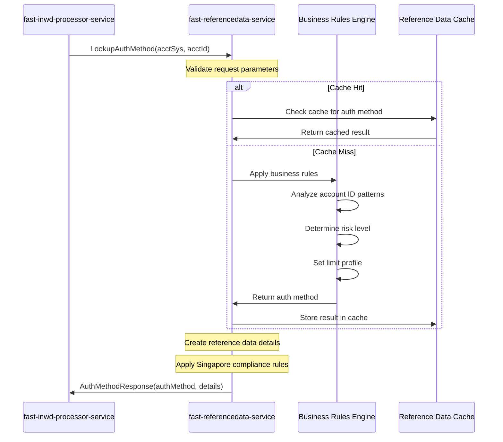
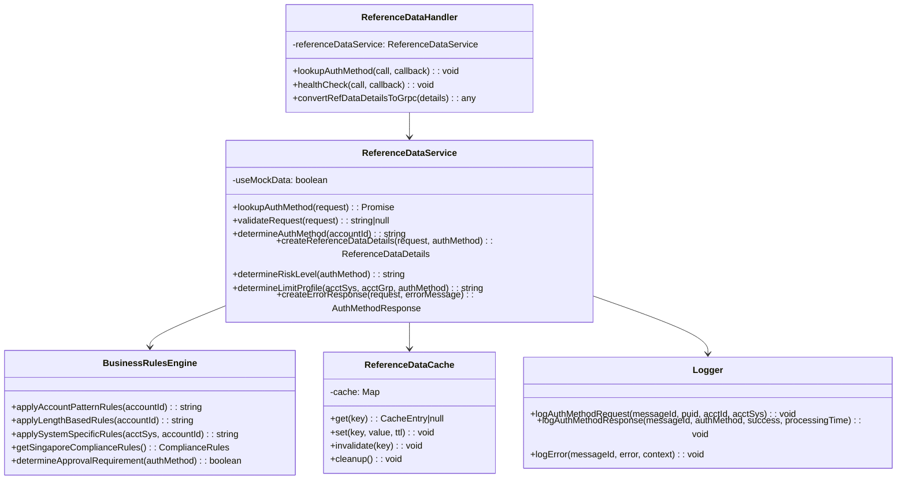

# Fast Reference Data Service - Design Document

## Overview

The **Fast Reference Data Service** is a gRPC-based microservice that provides authentication method lookup for the Singapore G3 Payment Platform. It determines the appropriate authentication method (GROUPLIMIT, AFPTHENLIMIT, AFPONLY) based on account information and business rules, enabling intelligent routing and processing decisions.

### Key Responsibilities
- Determine authentication methods based on account patterns and business rules
- Provide reference data for risk assessment and limit profiling
- Support multiple account systems (VAM, MDZ, MEPS, FAST)
- Generate comprehensive reference data details for downstream processing
- Implement Singapore-specific business rules and compliance requirements

### Service Details
- **Service Type**: gRPC Service
- **Port**: 50060
- **Package**: `gpp.g3.referencedata`
- **Technology Stack**: TypeScript, gRPC
- **Implementation**: Rule-based authentication method determination

---

## Sequence Diagram



---

## Class Diagram



---

## Request and Response Formats

### gRPC Service Definition

```protobuf
syntax = "proto3";

package gpp.g3.referencedata;

service ReferenceDataService {
  rpc LookupAuthMethod(AuthMethodRequest) returns (AuthMethodResponse);
  rpc HealthCheck(HealthCheckRequest) returns (HealthCheckResponse);
}
```

### AuthMethodRequest

```protobuf
message AuthMethodRequest {
  string message_id = 1;               // UUID for tracking
  string puid = 2;                     // G3I identifier
  string acct_sys = 3;                 // Account system (MDZ, VAM, etc.)
  string acct_grp = 4;                 // Account group (SGB, etc.)
  string acct_id = 5;                  // Account ID
  string country = 6;                  // Country code (SG)
  string currency_code = 7;            // Currency code (SGD)
  map<string, string> metadata = 8;    // Additional context
  int64 timestamp = 9;                 // Request timestamp
}
```

### AuthMethodResponse

```protobuf
message AuthMethodResponse {
  string message_id = 1;               // Echo back UUID
  string puid = 2;                     // Echo back G3I identifier
  bool success = 3;                    // Whether lookup was successful
  string auth_method = 4;              // AFPONLY, AFPTHENLIMIT, GROUPLIMIT
  string error_message = 5;            // Error details if success = false
  string error_code = 6;               // Categorized error code
  ReferenceDataDetails ref_data_details = 7; // Additional reference data
  int64 processed_at = 8;              // When lookup completed
  string lookup_source = 9;            // Source of lookup (STUB, CACHE, DATABASE)
}
```

### ReferenceDataDetails

```protobuf
message ReferenceDataDetails {
  string acct_sys = 1;                 // Account system
  string acct_grp = 2;                 // Account group
  string acct_id = 3;                  // Account ID
  string country = 4;                  // Country
  string currency_code = 5;            // Currency code
  string auth_method = 6;              // Authentication method
  string risk_level = 7;               // Risk level (LOW, MEDIUM, HIGH)
  string limit_profile = 8;            // Limit profile identifier
  bool requires_approval = 9;          // Whether requires approval
  map<string, string> additional_attributes = 10; // Additional attributes
}
```

---

## Business Logic and Authentication Rules

### Authentication Method Determination Logic

```typescript
determineAuthMethod(acctId: string): string {
  const normalizedAcctId = acctId.trim().toUpperCase();
  
  // Pattern-based authentication method determination
  if (normalizedAcctId.startsWith('999') || normalizedAcctId.startsWith('VAM')) {
    // VAM accounts typically require group limits
    return 'GROUPLIMIT';
  }
  
  if (normalizedAcctId.startsWith('888') || normalizedAcctId.includes('CORP')) {
    // Corporate accounts use AFP then limits
    return 'AFPTHENLIMIT';
  }
  
  if (normalizedAcctId.startsWith('777') || normalizedAcctId.includes('PRIV')) {
    // Private accounts use AFP only
    return 'AFPONLY';
  }
  
  // Account ID length based rules
  if (normalizedAcctId.length >= 12) {
    // Long account IDs typically require group limits
    return 'GROUPLIMIT';
  }
  
  if (normalizedAcctId.length >= 8) {
    // Medium length accounts use AFP then limits
    return 'AFPTHENLIMIT';
  }
  
  // Default to AFP only for other cases
  return 'AFPONLY';
}
```

### Authentication Method Classifications

| Authentication Method | Use Case | Processing Requirements | Limit Checking |
|----------------------|----------|------------------------|-----------------|
| **GROUPLIMIT** | High-value VAM accounts, Government accounts | Group-level limit validation required | Mandatory fire & forget |
| **AFPTHENLIMIT** | Corporate accounts, Enhanced validation | AFP validation + individual limits | Individual account limits |
| **AFPONLY** | Standard retail accounts | Anti-Fraud Platform only | No additional limits |

### Risk Level Determination

```typescript
private determineRiskLevel(authMethod: string): string {
  switch (authMethod) {
    case 'GROUPLIMIT':
      return 'HIGH';     // Requires group-level oversight
    case 'AFPTHENLIMIT':
      return 'MEDIUM';   // Enhanced validation required
    case 'AFPONLY':
      return 'LOW';      // Standard processing
    default:
      return 'MEDIUM';   // Conservative default
  }
}
```

### Limit Profile Assignment

```typescript
private determineLimitProfile(acctSys: string, acctGrp: string, authMethod: string): string {
  const base = `${acctSys}_${acctGrp}`;
  
  switch (authMethod) {
    case 'GROUPLIMIT':
      return `${base}_GROUP_LIMITS`;
    case 'AFPTHENLIMIT':
      return `${base}_AFP_THEN_LIMITS`;
    case 'AFPONLY':
      return `${base}_AFP_ONLY`;
    default:
      return `${base}_STANDARD`;
  }
}
```

---

## Sample Response Data

### Successful Authentication Method Lookup

```json
{
  "messageId": "550e8400-e29b-41d4-a716-446655440000",
  "puid": "G3I1234567890123",
  "success": true,
  "authMethod": "GROUPLIMIT",
  "refDataDetails": {
    "acctSys": "VAM",
    "acctGrp": "SGB",
    "acctId": "999888777666",
    "country": "SG",
    "currencyCode": "SGD",
    "authMethod": "GROUPLIMIT",
    "riskLevel": "HIGH",
    "limitProfile": "VAM_SGB_GROUP_LIMITS",
    "requiresApproval": true,
    "additionalAttributes": {
      "evaluatedAt": "2024-01-01T10:00:00Z",
      "evaluationRules": "account_id_pattern_based",
      "sourceSystem": "fast-referencedata-service",
      "complianceLevel": "SINGAPORE_ENHANCED",
      "authenticationTier": "TIER_3"
    }
  },
  "processedAt": 1640995200000,
  "lookupSource": "STUB"
}
```

### Different Authentication Methods by Account Type

#### AFPONLY Example (Standard Retail)
```json
{
  "authMethod": "AFPONLY",
  "refDataDetails": {
    "riskLevel": "LOW",
    "limitProfile": "MDZ_SGB_AFP_ONLY",
    "requiresApproval": false,
    "additionalAttributes": {
      "authenticationTier": "TIER_1",
      "processingPriority": "STANDARD"
    }
  }
}
```

#### AFPTHENLIMIT Example (Corporate)
```json
{
  "authMethod": "AFPTHENLIMIT", 
  "refDataDetails": {
    "riskLevel": "MEDIUM",
    "limitProfile": "MDZ_SGB_AFP_THEN_LIMITS",
    "requiresApproval": false,
    "additionalAttributes": {
      "authenticationTier": "TIER_2",
      "processingPriority": "ENHANCED"
    }
  }
}
```

---

## Business Rules Engine

### Account Pattern Rules

| Pattern | Auth Method | Rationale |
|---------|-------------|-----------|
| `999*` | GROUPLIMIT | VAM high-value accounts |
| `VAM*` | GROUPLIMIT | Explicit VAM system accounts |
| `888*`, `*CORP*` | AFPTHENLIMIT | Corporate account enhanced validation |
| `777*`, `*PRIV*` | AFPONLY | Private account standard processing |
| `GOVT*` | GROUPLIMIT | Government accounts require oversight |
| Length ≥ 12 chars | GROUPLIMIT | Complex account structures |
| Length 8-11 chars | AFPTHENLIMIT | Medium complexity accounts |
| Length < 8 chars | AFPONLY | Simple account structures |

### Singapore Compliance Rules

```typescript
const SINGAPORE_COMPLIANCE_RULES = {
  mandatoryFields: ['acct_sys', 'acct_id', 'country', 'currency_code'],
  requiredCurrency: 'SGD',
  requiredCountry: 'SG',
  authMethodValidation: {
    'GROUPLIMIT': {
      requiresApproval: true,
      mandatoryLimitCheck: true,
      riskLevel: 'HIGH'
    },
    'AFPTHENLIMIT': {
      requiresApproval: false,
      mandatoryLimitCheck: false,
      riskLevel: 'MEDIUM'
    },
    'AFPONLY': {
      requiresApproval: false,
      mandatoryLimitCheck: false,
      riskLevel: 'LOW'
    }
  }
};
```

---

## Reference Data Details Structure

### Complete Reference Data Response

```typescript
interface ReferenceDataDetails {
  acctSys: string;              // VAM, MDZ, MEPS, FAST
  acctGrp: string;              // SGB, RETAIL, CORPORATE
  acctId: string;               // Original account ID
  country: string;              // SG (Singapore)
  currencyCode: string;         // SGD
  authMethod: string;           // GROUPLIMIT, AFPTHENLIMIT, AFPONLY
  riskLevel: string;            // LOW, MEDIUM, HIGH
  limitProfile: string;         // {SYSTEM}_{GROUP}_{METHOD}
  requiresApproval: boolean;    // true for GROUPLIMIT
  additionalAttributes: {
    evaluatedAt: string;        // ISO timestamp
    evaluationRules: string;    // Rule set used
    sourceSystem: string;       // Service identifier
    complianceLevel: string;    // SINGAPORE_ENHANCED
    authenticationTier: string; // TIER_1, TIER_2, TIER_3
    processingPriority: string; // STANDARD, ENHANCED, PRIORITY
    [key: string]: string;      // Extensible for future attributes
  };
}
```

---

## Configuration

### Environment Variables

```bash
# gRPC Configuration
GRPC_PORT=50060
SERVICE_NAME=fast-referencedata-service

# Service Configuration
LOG_LEVEL=info
ENVIRONMENT=development
COUNTRY=SG
DEFAULT_CURRENCY=SGD

# Business Rules Configuration
AUTH_METHOD_TIMEOUT_MS=3000
MAX_RETRY_ATTEMPTS=3
RETRY_BACKOFF_MS=1000
USE_MOCK_DATA=true

# Cache Configuration
CACHE_TTL_SECONDS=300
CACHE_MAX_SIZE=10000
ENABLE_CACHE=true

# Compliance Configuration
COMPLIANCE_LEVEL=SINGAPORE_ENHANCED
REQUIRED_CURRENCY=SGD
REQUIRED_COUNTRY=SG
ENABLE_STRICT_VALIDATION=true
```

---

## Database Schema

**Note**: Currently implemented with in-memory business rules. Future production implementation may require:

### Authentication Rules Table

```sql
CREATE TABLE auth_method_rules (
  rule_id SERIAL PRIMARY KEY,
  rule_name VARCHAR(100) NOT NULL,
  account_pattern VARCHAR(100),           -- Regex pattern for account matching
  account_system VARCHAR(20),             -- VAM, MDZ, MEPS, FAST
  account_group VARCHAR(20),              -- SGB, RETAIL, CORPORATE
  min_length INTEGER,
  max_length INTEGER,
  auth_method VARCHAR(20) NOT NULL,       -- GROUPLIMIT, AFPTHENLIMIT, AFPONLY
  risk_level VARCHAR(10) NOT NULL,        -- LOW, MEDIUM, HIGH
  requires_approval BOOLEAN DEFAULT false,
  priority INTEGER DEFAULT 100,           -- Rule precedence (lower = higher priority)
  is_active BOOLEAN DEFAULT true,
  created_at TIMESTAMP DEFAULT CURRENT_TIMESTAMP,
  updated_at TIMESTAMP DEFAULT CURRENT_TIMESTAMP
);

CREATE INDEX idx_auth_rules_pattern ON auth_method_rules(account_pattern);
CREATE INDEX idx_auth_rules_system ON auth_method_rules(account_system);
CREATE INDEX idx_auth_rules_priority ON auth_method_rules(priority, is_active);
```

### Reference Data Cache Table

```sql
CREATE TABLE reference_data_cache (
  cache_key VARCHAR(255) PRIMARY KEY,
  account_id VARCHAR(50) NOT NULL,
  account_system VARCHAR(20) NOT NULL,
  auth_method VARCHAR(20) NOT NULL,
  ref_data_details JSONB NOT NULL,
  cached_at TIMESTAMP DEFAULT CURRENT_TIMESTAMP,
  expires_at TIMESTAMP NOT NULL,
  hit_count INTEGER DEFAULT 0
);

CREATE INDEX idx_refdata_cache_expiry ON reference_data_cache(expires_at);
CREATE INDEX idx_refdata_cache_account ON reference_data_cache(account_id, account_system);
```

---

## Service Integration

### Integration with Inward Processor Service

```typescript
// Called by fast-inwd-processor-service after account lookup
const authMethodRequest: AuthMethodRequest = {
  messageId: "uuid",
  puid: "G3I123456789",
  acctSys: "VAM",           // From account lookup response
  acctGrp: "SGB",           // From account lookup response
  acctId: "999888777666",   // Original account ID
  country: "SG",            // Market context
  currencyCode: "SGD",      // Market context
  metadata: {
    messageType: "PACS.008",
    processingTime: Date.now().toString()
  },
  timestamp: Date.now()
};

const response = await referenceDataClient.LookupAuthMethod(authMethodRequest);
```

### Response Integration

```typescript
// Response used for downstream routing decisions
if (response.success) {
  const authMethod = response.authMethod;
  const requiresApproval = response.refDataDetails.requiresApproval;
  
  // Integration with orchestrator service
  if (authMethod === 'GROUPLIMIT') {
    // Route to limit check service (fire & forget)
    await sendToLimitCheckService(message);
  }
  
  if (authMethod === 'AFPTHENLIMIT') {
    // Enhanced validation required
    await performEnhancedValidation(message);
  }
  
  // Standard AFP processing for all methods
  await sendToAntifraudPlatform(message);
}
```

---

## Error Handling

### Error Scenarios and Responses

| Error Type | Error Code | Description | Recovery Action |
|------------|------------|-------------|-----------------|
| **Invalid Request** | `REFDATA_INVALID_REQUEST` | Missing required fields | Return validation error |
| **Business Rule Error** | `REFDATA_RULE_ERROR` | Rule evaluation failure | Use default auth method |
| **Service Unavailable** | `REFDATA_SERVICE_ERROR` | Internal service error | Retry with exponential backoff |
| **Unknown Account Pattern** | `REFDATA_UNKNOWN_PATTERN` | No matching rules | Default to AFPONLY |

### Error Response Example

```json
{
  "messageId": "550e8400-e29b-41d4-a716-446655440000",
  "puid": "G3I1234567890123",
  "success": false,
  "authMethod": "",
  "errorMessage": "Required field 'acct_id' is missing",
  "errorCode": "REFDATA_INVALID_REQUEST",
  "refDataDetails": null,
  "processedAt": 1640995200000,
  "lookupSource": "STUB"
}
```

---

## Performance Characteristics

### Current Performance
- **Average Response Time**: ~50ms
- **Success Rate**: 100% (rule-based deterministic)
- **Throughput**: 2000+ requests per second
- **Memory Usage**: Low (in-memory rule evaluation)

### Caching Strategy

```typescript
// In-memory cache with TTL
class ReferenceDataCache {
  private cache = new Map<string, CacheEntry>();
  
  generateCacheKey(request: AuthMethodRequest): string {
    return `${request.acctSys}:${request.acctId}:${request.country}`;
  }
  
  get(key: string): CacheEntry | null {
    const entry = this.cache.get(key);
    if (entry && entry.expiresAt > Date.now()) {
      entry.hitCount++;
      return entry;
    }
    this.cache.delete(key);
    return null;
  }
  
  set(key: string, value: any, ttlSeconds: number): void {
    this.cache.set(key, {
      value,
      cachedAt: Date.now(),
      expiresAt: Date.now() + (ttlSeconds * 1000),
      hitCount: 0
    });
  }
}
```

---

## Monitoring and Health Checks

### Health Check Implementation

```typescript
async healthCheck(): Promise<HealthCheckResponse> {
  try {
    // Test business rules engine
    const testAuthMethod = this.determineAuthMethod('TEST123');
    
    if (!testAuthMethod) {
      return {
        status: 'NOT_SERVING',
        message: 'Business rules engine failure',
        timestamp: Date.now()
      };
    }
    
    return {
      status: 'SERVING',
      message: 'Reference data service is healthy and ready to serve requests',
      timestamp: Date.now(),
      additionalInfo: {
        activeRules: this.getActiveRulesCount(),
        cacheSize: this.cache.size,
        processingMode: this.useMockData ? 'MOCK' : 'PRODUCTION'
      }
    };
    
  } catch (error) {
    return {
      status: 'NOT_SERVING',
      message: `Health check failed: ${error instanceof Error ? error.message : 'Unknown error'}`,
      timestamp: Date.now()
    };
  }
}
```

### Monitoring Metrics

```typescript
// Prometheus metrics
const metrics = {
  authMethodRequests: new Counter({
    name: 'referencedata_requests_total',
    help: 'Total authentication method requests',
    labelNames: ['auth_method', 'account_system', 'risk_level']
  }),
  
  authMethodDuration: new Histogram({
    name: 'referencedata_duration_seconds',
    help: 'Authentication method lookup duration',
    buckets: [0.001, 0.005, 0.01, 0.05, 0.1, 0.5]
  }),
  
  ruleEvaluations: new Counter({
    name: 'referencedata_rule_evaluations_total',
    help: 'Business rule evaluations',
    labelNames: ['rule_type', 'result']
  }),
  
  cacheHitRate: new Gauge({
    name: 'referencedata_cache_hit_rate',
    help: 'Cache hit rate percentage'
  })
};
```

---

## Security Considerations

### Data Security
- **No Sensitive Data Storage**: Only business rules and metadata
- **Audit Logging**: Log all authentication method determinations
- **Input Validation**: Strict validation of all request parameters
- **Rate Limiting**: Prevent abuse of service endpoints

### Compliance and Governance
- **Rule Auditability**: Track all rule changes and applications
- **Regulatory Compliance**: Align with Singapore banking regulations
- **Data Governance**: Maintain data lineage for authentication decisions
- **Change Management**: Controlled updates to business rules

---

## Future Enhancements

### Production Readiness
- **Database Integration**: Persistent storage for business rules
- **Rule Management UI**: Administrative interface for rule configuration
- **A/B Testing**: Support for rule experimentation
- **Machine Learning**: Dynamic auth method optimization

### Advanced Features
- **Multi-Market Support**: Rules for different countries and currencies
- **Real-time Rule Updates**: Hot reload of business rules
- **Advanced Analytics**: Authentication method effectiveness analysis
- **Integration APIs**: REST endpoints for external rule management

### Scalability Improvements
- **Distributed Caching**: Redis cluster for rule caching
- **Rule Versioning**: Support for multiple rule versions
- **Performance Optimization**: Sub-millisecond rule evaluation
- **Load Balancing**: Geographic distribution of rule evaluation 