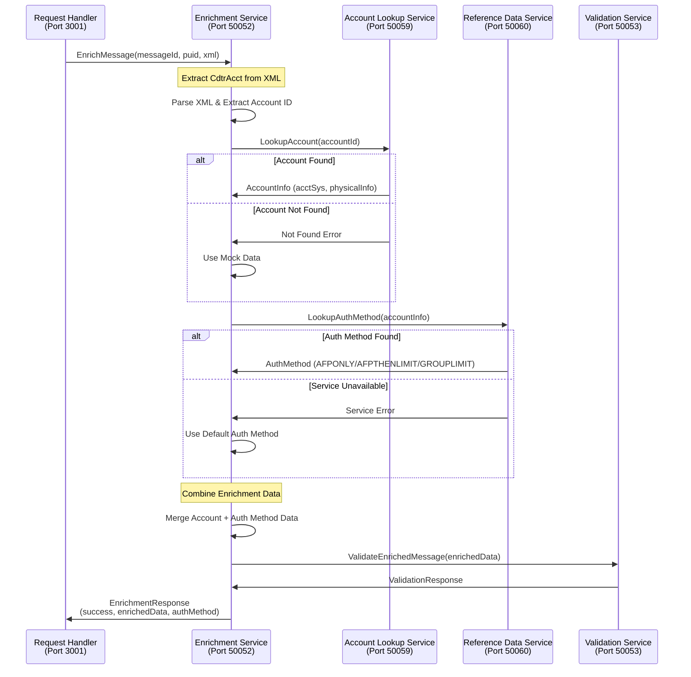

# Fast Enrichment Service

A gRPC-based microservice that enriches PACS messages with account lookup data and authentication method information. This service integrates with the Account Lookup Service and Reference Data Service to provide comprehensive message enrichment for the Singapore market.

## 🚀 Current Implementation Status: **COMPLETED**

### ✅ Features Implemented
- **gRPC Server**: Handles enrichment requests via gRPC
- **Account Lookup Integration**: Calls fast-accountlookup-service for account data
- **Reference Data Integration**: Calls fast-referencedata-service for authentication methods
- **XML Processing**: Extracts account information from PACS XML
- **Data Integration**: Combines lookup results with message data
- **Mock Mode**: Fallback mode when external services are unavailable
- **Health Check**: Service health monitoring via gRPC
- **Singapore Support**: SGD currency, SG country codes, timezone handling

### 🔧 Technology Stack
- **Runtime**: Node.js with TypeScript
- **Framework**: gRPC with @grpc/grpc-js
- **Port**: 50052 (gRPC)
- **Testing**: Playwright with PW-Core integration

## 📋 Service Details

### gRPC Service Definition
```protobuf
service EnrichmentService {
  rpc EnrichMessage(EnrichmentRequest) returns (EnrichmentResponse);
  rpc HealthCheck(HealthCheckRequest) returns (HealthCheckResponse);
}
```

### Enrichment Data Structure
```protobuf
message EnrichmentData {
  string received_acct_id = 1;
  int32 lookup_status_code = 2;
  string lookup_status_desc = 3;
  string normalized_acct_id = 4;
  string matched_acct_id = 5;
  string partial_match = 6;
  string is_physical = 7;
  PhysicalAccountInfo physical_acct_info = 8;
  string auth_method = 9;  // AFPONLY, AFPTHENLIMIT, GROUPLIMIT
}
```

## 🧪 Running Playwright Tests

### Prerequisites
```bash
# Install dependencies
npm install

# Install Playwright browsers
npx playwright install
```

### Test Commands
```bash
# Run all tests with mock mode (bypass external services)
NODE_ENV=test npm test

# Run tests with UI
npm run test:headed

# Run tests in debug mode
npm run test:debug

# Run specific test file
npx playwright test tests/pw-core-integration.spec.ts

# Run with detailed output
npx playwright test --reporter=line
```

### Test Configuration
The service uses **PW-Core** for standardized testing:
- **ServiceTestHelper**: Manages gRPC connections and test lifecycle
- **Mock Mode**: `NODE_ENV=test` or `USE_MOCK_MODE=true` for testing
- **SingaporeAssertions**: Singapore-specific validations

### Sample Test
```typescript
import { test, expect } from '@playwright/test';
import { ServiceTestHelper, SingaporeFixtures } from '@gpp/pw-core';

test.describe('Fast Enrichment Service', () => {
  let testHelper: ServiceTestHelper;

  test.beforeAll(async () => {
    // Enable mock mode for testing
    process.env.USE_MOCK_MODE = 'true';
    
    testHelper = new ServiceTestHelper('fast-enrichment-service');
    await testHelper.initialize();
  });

  test('should enrich PACS008 message', async () => {
    const message = SingaporeFixtures.loadPacs008();
    const response = await testHelper.processMessage(message);
    
    expect(response.success).toBe(true);
    expect(response.enrichmentData).toBeDefined();
    expect(response.enrichmentData.authMethod).toBeDefined();
  });
});
```

## 📊 Service Flow Diagram



## 🔄 Enrichment Process Flow

1. **Receive Message**: Accept enrichment request from request handler
2. **Parse XML**: Extract CdtrAcct (creditor account) information
3. **Account Lookup**: Call account lookup service for account details
4. **Reference Data**: Call reference data service for authentication method
5. **Data Integration**: Combine all enrichment data
6. **Forward to Validation**: Send enriched message to validation service
7. **Return Response**: Send enrichment response back to caller

## 🛠️ Development Setup

### Environment Variables
```bash
# Service Configuration
GRPC_PORT=50052
LOG_LEVEL=info

# External Service URLs
ACCOUNT_LOOKUP_SERVICE_URL=localhost:50059
REFERENCE_DATA_SERVICE_URL=localhost:50060
VALIDATION_SERVICE_URL=localhost:50053

# Testing Configuration
USE_MOCK_MODE=false
NODE_ENV=development
```

### Running the Service
```bash
# Development mode
npm run dev

# Development mode with mock services
USE_MOCK_MODE=true npm run dev

# Production mode
npm run build
npm start
```

### Health Check
```bash
# Check service health
grpcurl -plaintext localhost:50052 gpp.g3.enrichment.EnrichmentService/HealthCheck
```

## 📁 Project Structure

```
fast-enrichment-service/
├── src/
│   ├── grpc/
│   │   ├── server.ts                 # gRPC server setup
│   │   └── handlers/
│   │       └── enrichmentHandler.ts  # Main enrichment logic
│   ├── services/
│   │   ├── xmlProcessor.ts           # XML parsing and extraction
│   │   ├── accountLookupClient.ts    # Account lookup service client
│   │   ├── referenceDataClient.ts    # Reference data service client
│   │   └── validationClient.ts       # Validation service client
│   ├── utils/
│   │   ├── mockDataGenerator.ts      # Mock data for testing
│   │   ├── logger.ts                 # Structured logging
│   │   └── xmlParser.ts              # XML utilities
│   └── index.ts                      # Entry point
├── proto/
│   └── enrichment_service.proto      # gRPC service definition
├── tests/
│   └── pw-core-integration.spec.ts   # Playwright tests
└── fixtures/
    └── singapore/                    # Test fixtures
```

## 🔍 Authentication Method Logic

### Authentication Methods
- **AFPONLY**: Standard flow, no additional limit checks
- **AFPTHENLIMIT**: Standard flow with basic limit validation
- **GROUPLIMIT**: Enhanced flow with group-based limit checking

### Routing Logic
```typescript
const determineAuthMethod = (accountInfo: AccountInfo): string => {
  if (accountInfo.accountId.startsWith('999') || 
      accountInfo.accountId.includes('VAM')) {
    return 'GROUPLIMIT';
  }
  
  if (accountInfo.accountId.startsWith('888') || 
      accountInfo.accountId.includes('CORP')) {
    return 'AFPTHENLIMIT';
  }
  
  return 'AFPONLY';
};
```

## 🧪 Mock Mode Configuration

### When to Use Mock Mode
- **Testing**: Automated tests without external dependencies
- **Development**: Local development without running all services
- **CI/CD**: Continuous integration testing

### Mock Data Configuration
```typescript
const mockEnrichmentData = {
  receivedAcctId: '123456789',
  lookupStatusCode: 200,
  normalizedAcctId: '123456789',
  authMethod: 'AFPONLY',
  physicalAcctInfo: {
    acctSys: 'MDZ',
    bankCode: 'DBSSSGSG'
  }
};
```

## 🚨 Error Handling

### Error Categories
- **XML Parsing Errors**: Invalid or malformed XML
- **Account Lookup Errors**: Account not found or service unavailable
- **Reference Data Errors**: Authentication method lookup failures
- **Validation Errors**: Enriched message validation failures

### Fallback Strategies
- **Mock Data**: Use mock data when external services are unavailable
- **Default Auth Method**: Use `AFPONLY` as default authentication method
- **Partial Enrichment**: Continue with available data if some services fail

## 🔗 Integration Points

### Upstream Services
- **Fast Request Handler Service**: Receives enrichment requests

### Downstream Services
- **Fast Account Lookup Service**: Account information retrieval
- **Fast Reference Data Service**: Authentication method lookup
- **Fast Validation Service**: Enriched message validation

## 📊 Service Health Monitoring

### Health Check Response
```json
{
  "status": "SERVING",
  "message": "Service is healthy",
  "dependencies": {
    "accountLookupService": "SERVING",
    "referenceDataService": "SERVING",
    "validationService": "SERVING"
  }
}
```

### Service Dependencies
- **Account Lookup Service**: Critical for account enrichment
- **Reference Data Service**: Critical for authentication method
- **Validation Service**: Critical for message validation

## 🎯 Singapore Market Support

### Supported Features
- **Currency**: SGD (Singapore Dollar)
- **Country Codes**: SG (Singapore)
- **Bank Codes**: Singapore bank BIC codes
- **Account Systems**: VAM, MDZ, MEPS

### Test Scenarios
- **VAM Accounts**: Account IDs starting with '999'
- **Corporate Accounts**: Account IDs starting with '888'
- **Retail Accounts**: Standard account IDs

---

## 📚 Additional Resources

- [Account Lookup Service Integration](../fast-accountlookup-service/README.md)
- [Reference Data Service Integration](../fast-referencedata-service/README.md)
- [Validation Service Integration](../fast-validation-service/README.md)
- [PW-Core Testing Framework](../pw-core/README.md) 