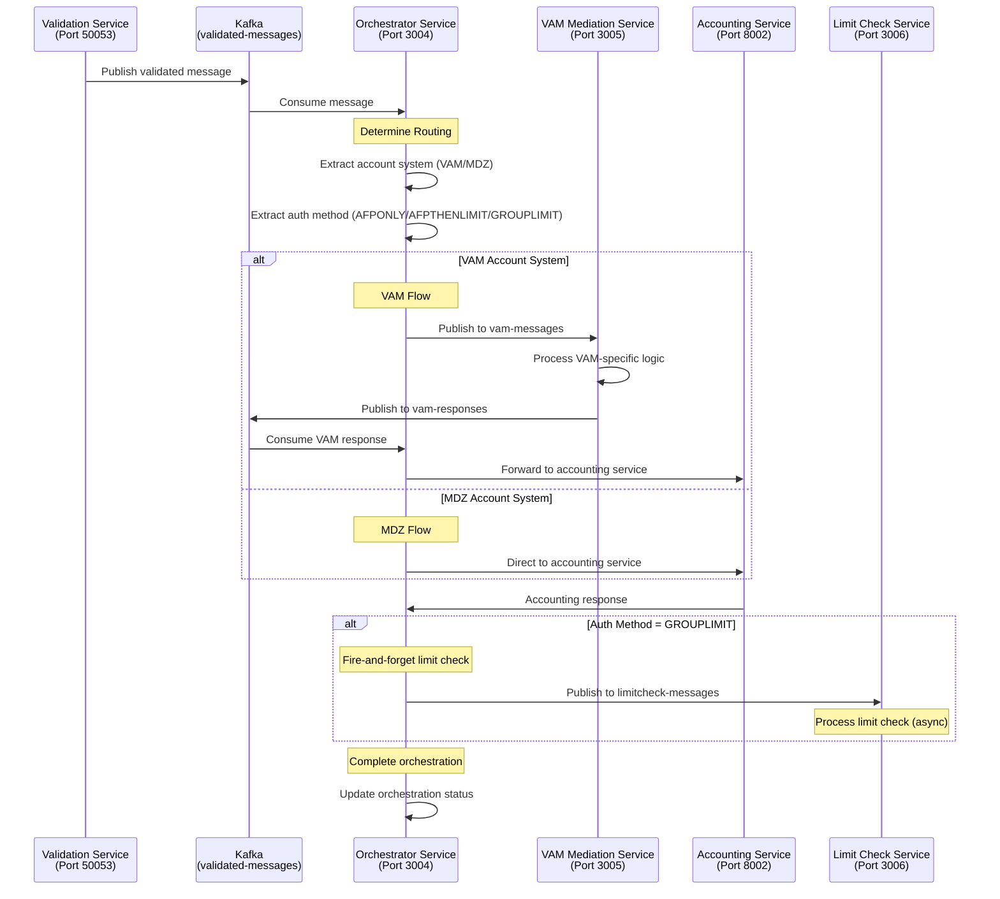

# Fast Orchestrator Service

An HTTP-based microservice that orchestrates the complete PACS message processing pipeline. This service consumes validated messages from Kafka, determines routing based on account systems and authentication methods, and coordinates with downstream services for transaction processing.

## 🚀 Current Implementation Status: **COMPLETED**

### ✅ Features Implemented
- **HTTP REST API**: Express.js server with comprehensive endpoints
- **Kafka Consumer**: Consumes validated messages from fast-validation-service
- **Smart Routing**: Routes messages based on account system (VAM/MDZ) and authentication method
- **VAM Integration**: Handles VAM-specific routing with response correlation
- **Limit Check Integration**: Fire-and-forget limit checking for GROUPLIMIT transactions
- **Orchestration Tracking**: Comprehensive audit trail and status tracking
- **Health Check**: Service health monitoring via HTTP endpoint
- **API Monitoring**: Real-time message and orchestration status endpoints

### 🔧 Technology Stack
- **Runtime**: Node.js with TypeScript
- **Framework**: Express.js for HTTP API
- **Port**: 3004 (HTTP)
- **Message Queue**: Kafka for message consumption and publishing
- **Testing**: Playwright with custom HTTP test helpers

## 📋 Service Details

### HTTP API Endpoints
```
GET  /health                           # Service health check
GET  /api/v1/messages                  # Get all processed messages
GET  /api/v1/orchestration             # Get all orchestration statuses
GET  /api/v1/orchestration/:messageId  # Get specific orchestration status
```

### Kafka Topics
- **Consumes**: `validated-messages` (from validation service)
- **Publishes**: `vam-messages` (to VAM mediation service)
- **Publishes**: `limitcheck-messages` (to limit check service)
- **Consumes**: `vam-responses` (from VAM mediation service)

## 🧪 Running Playwright Tests

### Prerequisites
```bash
# Install dependencies
npm install

# Install Playwright browsers
npx playwright install
```

### Test Commands
```bash
# Run all tests (requires service to be running)
npm test

# Run tests with UI
npm run test:headed

# Run tests in debug mode
npm run test:debug

# Run specific test file
npx playwright test tests/pw-core-integration.spec.ts

# Run with detailed output
npx playwright test --reporter=line
```

### Starting the Service for Testing
```bash
# Start the service in background
npm run dev

# Or start with specific configuration
KAFKA_BROKERS=localhost:9092 npm run dev
```

### Test Configuration
The service uses **custom HTTP testing approach** since it's not a gRPC service:
- **HttpTestHelper**: Custom HTTP client for REST API testing
- **Message Simulation**: Simulates message processing since it's Kafka-based
- **Singapore Test Data**: Pre-configured test messages and accounts

### Sample Test
```typescript
import { test, expect } from '@playwright/test';
import { HttpTestHelper, MessageBuilder } from '../tests/utils';

test.describe('Fast Orchestrator Service', () => {
  let testHelper: HttpTestHelper;

  test.beforeAll(async () => {
    testHelper = new HttpTestHelper('http://localhost:3004');
  });

  test('should perform health check', async () => {
    const response = await testHelper.healthCheck();
    expect(response.healthy).toBe(true);
    expect(response.service).toBe('fast-orchestrator-service');
  });

  test('should handle VAM routing decisions', async () => {
    const message = new MessageBuilder()
      .withMessageType('PACS008')
      .withAccount('999888777666') // VAM account
      .build();

    const response = await testHelper.processMessage(message);
    expect(response.success).toBe(true);
  });
});
```

## 📊 Service Flow Diagram



## 🔄 Orchestration Process Flow

1. **Message Consumption**: Consume validated messages from Kafka
2. **Routing Decision**: Determine account system (VAM/MDZ) and authentication method
3. **VAM Flow**: For VAM accounts, route through VAM mediation service
4. **MDZ Flow**: For MDZ accounts, route directly to accounting service
5. **Limit Check**: For GROUPLIMIT auth method, trigger limit check (fire-and-forget)
6. **Status Tracking**: Maintain comprehensive orchestration audit trail
7. **Completion**: Mark orchestration as complete with final status

## 🛠️ Development Setup

### Environment Variables
```bash
# Service Configuration
PORT=3004
LOG_LEVEL=info

# Kafka Configuration
KAFKA_BROKERS=localhost:9092
KAFKA_TOPIC=validated-messages
KAFKA_GROUP_ID=fast-orchestrator-group

# VAM Configuration
VAM_KAFKA_TOPIC=vam-messages
VAM_RESPONSE_TOPIC=vam-responses
VAM_MEDIATION_SERVICE_URL=http://localhost:3005

# Limit Check Configuration
LIMITCHECK_KAFKA_TOPIC=limitcheck-messages
LIMITCHECK_SERVICE_URL=http://localhost:3006

# Downstream Services
ACCOUNTING_SERVICE_URL=http://localhost:8002

# Market Configuration
COUNTRY=SG
DEFAULT_CURRENCY=SGD
```

### Running the Service
```bash
# Development mode
npm run dev

# Production mode
npm run build
npm start
```

### Health Check
```bash
# Check service health
curl http://localhost:3004/health | jq .
```

## 📁 Project Structure

```
fast-orchestrator-service/
├── src/
│   └── index.ts                      # Main service implementation
├── tests/
│   ├── pw-core-integration.spec.ts   # Playwright tests
│   ├── fixtures/
│   │   └── singapore/                # Test fixtures
│   └── utils/
│       └── singapore-assertions.ts   # Test assertions
├── package.json                      # Dependencies and scripts
└── README.md                         # This file
```

## 🔍 Routing Logic

### Account System Routing
```typescript
const determineRoute = (validatedMessage: any): string => {
  const acctSys = validatedMessage.enrichmentData?.physicalAcctInfo?.acctSys;
  const authMethod = validatedMessage.enrichmentData?.authMethod;
  
  if (acctSys === 'VAM') {
    return 'vam_flow';
  } else if (acctSys === 'MDZ') {
    return 'mdz_flow';
  } else {
    return 'standard_flow';
  }
};
```

### Authentication Method Handling
- **AFPONLY**: Standard processing, no limit checks
- **AFPTHENLIMIT**: Standard processing, no limit checks
- **GROUPLIMIT**: Enhanced processing with post-accounting limit checks

### Limit Check Integration
```typescript
// Fire-and-forget limit check for GROUPLIMIT
if (authMethod === 'GROUPLIMIT') {
  await sendToLimitCheckServiceFireAndForget(messageId, validatedMessage);
}
```

## 🧪 Test Data and Fixtures

### Singapore Test Accounts
```typescript
export const SINGAPORE_TEST_ACCOUNTS = {
  STANDARD_RETAIL: {
    accountId: '123456789012',
    expectedSystem: 'MDZ',
    routingHint: 'MDZ'
  },
  VAM_ACCOUNT: {
    accountId: '999888777666',
    expectedSystem: 'VAM',
    routingHint: 'VAM'
  }
};
```

### PACS Test Messages
```typescript
export const SINGAPORE_PACS_MESSAGES = {
  PACS008: '<?xml version="1.0" encoding="UTF-8"?>...',
  PACS007: '<?xml version="1.0" encoding="UTF-8"?>...',
  PACS003: '<?xml version="1.0" encoding="UTF-8"?>...'
};
```

## 📊 API Response Examples

### Health Check Response
```json
{
  "service": "fast-orchestrator-service",
  "status": "healthy",
  "timestamp": "2025-01-10T10:30:00Z",
  "version": "1.0.0",
  "environment": "development",
  "kafka": {
    "connected": true,
    "topic": "validated-messages",
    "groupId": "fast-orchestrator-group",
    "vamTopic": "vam-messages",
    "limitCheckTopic": "limitcheck-messages"
  }
}
```

### Orchestration Status Response
```json
{
  "orchestration": {
    "messageId": "550e8400-e29b-41d4-a716-446655440000",
    "puid": "G3I1234567890123",
    "currentStep": "completed",
    "status": "success",
    "steps": [
      {
        "stepName": "routing",
        "status": "completed",
        "timestamp": "2025-01-10T10:30:00Z",
        "data": {"route": "vam_flow"}
      },
      {
        "stepName": "vam_mediation",
        "status": "completed",
        "timestamp": "2025-01-10T10:30:15Z"
      },
      {
        "stepName": "accounting",
        "status": "completed",
        "timestamp": "2025-01-10T10:30:30Z"
      }
    ],
    "startTime": 1704884200000,
    "completedAt": "2025-01-10T10:30:45Z"
  }
}
```

## 🚨 Error Handling

### Error Categories
- **Kafka Connection Errors**: Message consumption/publishing failures
- **Routing Errors**: Invalid account system or authentication method
- **Downstream Service Errors**: VAM mediation or accounting service failures
- **Timeout Errors**: Service response timeouts

### Error Response Format
```json
{
  "error": "Orchestration failed",
  "messageId": "550e8400-e29b-41d4-a716-446655440000",
  "currentStep": "vam_mediation",
  "errorDetails": "VAM mediation service timeout",
  "timestamp": "2025-01-10T10:30:00Z"
}
```

## 📊 Monitoring & Observability

### Health Endpoints
- **Service Health**: `/health` - Overall service status
- **Messages**: `/api/v1/messages` - All processed messages
- **Orchestration**: `/api/v1/orchestration` - All orchestration statuses

### Logging
- **Structured Logging**: JSON format with correlation IDs
- **Orchestration Steps**: Detailed step-by-step processing logs
- **Performance Metrics**: Processing duration and throughput

### Metrics
- **Message Processing**: Success/failure rates by message type
- **Routing Distribution**: VAM vs MDZ routing statistics
- **Authentication Methods**: Distribution of auth methods processed

## 🎯 Singapore Market Support

### Supported Features
- **Currency**: SGD (Singapore Dollar)
- **Country**: SG (Singapore)
- **Account Systems**: VAM, MDZ, MEPS
- **Authentication Methods**: AFPONLY, AFPTHENLIMIT, GROUPLIMIT

### Business Rules
- **VAM Routing**: High-value and corporate accounts
- **MDZ Routing**: Standard retail accounts
- **Limit Checking**: Required for GROUPLIMIT authentication method

---

## 📚 Additional Resources

- [Kafka Documentation](https://kafka.apache.org/documentation/)
- [Express.js Guide](https://expressjs.com/en/guide/routing.html)
- [VAM Mediation Service](../vam-mediation-service/README.md)
- [Limit Check Service](../fast-limitcheck-service/README.md)
- [PW-Core Testing Framework](../pw-core/README.md) 