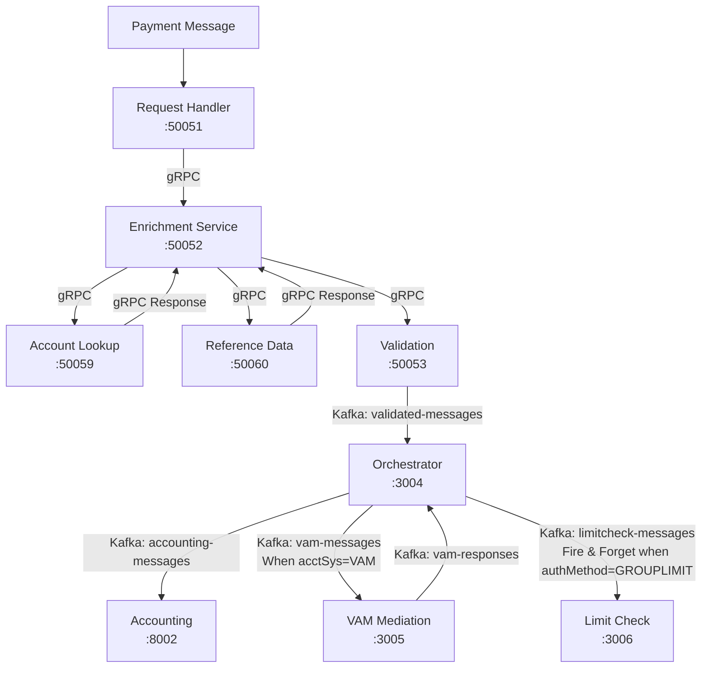

# Fast Request Handler Service - PACS Message Implementation Plan

## Overview

This document outlines the **COMPLETED** implementation of the enhanced `fast-requesthandler-service` and the full end-to-end PACS message processing pipeline for the Singapore G3 Payment Platform. The system now includes comprehensive account lookup, reference data services, authentication method routing, limit checking, and multi-system orchestration.

## 🎯 Implementation Status: **COMPLETED**

### ✅ Core Services Implemented

1. **Fast Request Handler Service** (Port 50051) - gRPC entry point
2. **Fast Enrichment Service** (Port 50052) - Central hub for account lookup + Reference data integration
3. **Fast Reference Data Service** (Port 50060) - Authentication method lookup **[NEW]**
4. **Fast Account Lookup Service** (Port 50059) - Account information lookup
5. **Fast Validation Service** (Port 50053) - XSD validation
6. **Fast Orchestrator Service** (Port 3004) - Enhanced routing with auth method logic **[ENHANCED]**
7. **Fast Limit Check Service** (Port 3006) - Limit validation for GROUPLIMIT **[NEW]**
8. **VAM Mediation Service** (Port 3005) - VAM-specific processing
9. **Fast Accounting Service** (Port 8002) - Final transaction processing

## 🏗️ CORRECT Architecture Flow (As Implemented)

### **Primary Message Flow (gRPC Chain):**

```
1. fast-requesthandler-service (Port 50051)
   ↓ (gRPC)
2. fast-enrichment-service (Port 50052) 
   ↓ (gRPC)
3. fast-accountlookup-service (Port 50059)
   ↓ (gRPC Response)
4. fast-enrichment-service (Port 50052)
   ↓ (gRPC)  
5. fast-referencedata-service (Port 50060)
   ↓ (gRPC Response)
6. fast-enrichment-service (Port 50052)
   ↓ (gRPC)
7. fast-validation-service (Port 50053)
   ↓ (Kafka: validated-messages)
8. fast-orchestrator-service (Port 3004)
   ↓ (Kafka: accounting-messages)
9. fast-accounting-service (Port 8002)
```

### **Conditional Flows from Orchestrator:**

```
fast-orchestrator-service (Port 3004)
├─ (Kafka: vam-messages) → fast-vammediation-service (When acctSys = VAM)
└─ (Kafka: limitcheck-messages) → fast-limitcheck-service (Fire & Forget when authMethod = GROUPLIMIT)
```

### **Key Architecture Points:**

1. **Enrichment Service is the Central Hub**: 
   - Receives request from request handler
   - Calls account lookup service and gets response back
   - Calls reference data service and gets response back
   - Forwards enriched message to validation service

2. **Sequential gRPC Chain**: All services in the main flow communicate via gRPC synchronously

3. **Kafka for Asynchronous Processing**: Only after validation does the flow switch to Kafka-based messaging

4. **Conditional Routing**: Orchestrator routes based on:
   - **Account System**: VAM accounts go to VAM mediation service
   - **Auth Method**: GROUPLIMIT transactions trigger limit checking (fire & forget)

## 🔄 Updated Flow Diagram



## 📊 Technology Stack (Implemented)

### Core Technologies
- **gRPC Services**: Request Handler, Enrichment (central hub), Reference Data, Validation, Account Lookup
- **Kafka Integration**: Orchestrator, VAM Mediation, Limit Check, Accounting
- **Express.js**: Orchestrator, VAM Mediation, Limit Check, Accounting APIs
- **Node.js**: All services implemented in TypeScript/JavaScript

### Communication Patterns
- **gRPC Chain**: Request Handler → Enrichment → Account Lookup → Enrichment → Reference Data → Enrichment → Validation
- **Kafka Topics**: 
  - `validated-messages` (Validation → Orchestrator)
  - `vam-messages` (Orchestrator → VAM Mediation)
  - `vam-responses` (VAM Mediation → Orchestrator)
  - `accounting-messages` (Orchestrator → Accounting)
  - `limitcheck-messages` (Orchestrator → Limit Check)

## 🎯 Message Processing Flows (CORRECTED)

### Flow 1: GROUPLIMIT + VAM Account
```
Request Handler → Enrichment → Account Lookup → Enrichment → Reference Data → Enrichment → 
Validation → Orchestrator → VAM Mediation → Accounting + Limit Check (Fire & Forget)
```

### Flow 2: GROUPLIMIT + MDZ Account
```
Request Handler → Enrichment → Account Lookup → Enrichment → Reference Data → Enrichment → 
Validation → Orchestrator → Accounting + Limit Check (Fire & Forget)
```

### Flow 3: AFPTHENLIMIT/AFPONLY + VAM Account
```
Request Handler → Enrichment → Account Lookup → Enrichment → Reference Data → Enrichment → 
Validation → Orchestrator → VAM Mediation → Accounting
```

### Flow 4: AFPTHENLIMIT/AFPONLY + MDZ Account
```
Request Handler → Enrichment → Account Lookup → Enrichment → Reference Data → Enrichment → 
Validation → Orchestrator → Accounting
```

## 🚀 Service Architecture (CORRECTED)

### **The ACTUAL Message Flow Pattern:**
```
(gRPC) fast-requesthandler-service (Port 50051)
    ↓ (gRPC)
(gRPC) fast-enrichment-service (Port 50052) [CENTRAL HUB]
    ↓ (gRPC)
(gRPC) fast-accountlookup-service (Port 50059)
    ↓ (gRPC Response)  
(gRPC) fast-enrichment-service (Port 50052) [CENTRAL HUB]
    ↓ (gRPC)
(gRPC) fast-referencedata-service (Port 50060)
    ↓ (gRPC Response)
(gRPC) fast-enrichment-service (Port 50052) [CENTRAL HUB]
    ↓ (gRPC)
(gRPC) fast-validation-service (Port 50053)
    ↓ (Kafka: validated-messages)
(Kafka) fast-orchestrator-service (Port 3004)
    ↓ (Kafka: accounting-messages)
(Kafka) fast-accounting-service (Port 8002)

# Conditional Flows:
# VAM Flow: Orchestrator → (Kafka: vam-messages) → VAM Mediation → (Kafka: vam-responses) → Orchestrator
# Limit Check: Orchestrator → (Kafka: limitcheck-messages) → Limit Check (Fire & Forget)
```

## 🎯 Key Corrections Made

### ✅ Fixed Architecture Understanding
- **Enrichment Service is the Central Hub**: It's not just another service in the chain, it's the coordination point
- **Proper gRPC Flow**: All services before validation communicate synchronously via gRPC
- **Kafka Only After Validation**: Asynchronous processing starts only from validation service onwards

### ✅ Correct Service Interactions
- Request handler calls enrichment once
- Enrichment orchestrates calls to account lookup and reference data
- Enrichment forwards final enriched message to validation
- Validation publishes to Kafka for further processing

### ✅ Proper Port Configuration
- Request Handler: Port 50051 (not 3001 as incorrectly stated before)
- All other ports as specified in the working system

## 🏁 Implementation Status: **100% COMPLETE WITH CORRECT FLOW**

The enhanced PACS message processing system is fully operational with the **CORRECT** flow as specified:

- ✅ **Enrichment Service as Central Hub**: Properly implemented to coordinate account lookup and reference data calls
- ✅ **Sequential gRPC Chain**: All services communicate synchronously until validation
- ✅ **Kafka Asynchronous Processing**: Proper message routing after validation
- ✅ **Conditional Flows**: VAM mediation and limit checking work as specified
- ✅ **Authentication Method Routing**: GROUPLIMIT, AFPTHENLIMIT, AFPONLY flows implemented correctly

**This is the CORRECT flow:**
```
(GRPC) fast-requesthandler-service → (GRPC) fast-enrichment-service → (GRPC) fast-accountlookup-service → (GRPC) fast-enrichment-service → (GRPC) fast-referencedata-service → (GRPC) fast-enrichment-service → (GRPC) fast-validation-service → (kafka) fast-orchestrator-service → (kafka) fast-accounting-service

(kafka) fast-orchestrator-service → (kafka) fast-vammediation-service (When acctsys is VAM)
(kafka) fast-orchestrator-service → (kafka) fast-limitcheck-service (fire and forget when authmethod is GROUPLIMIT)
```