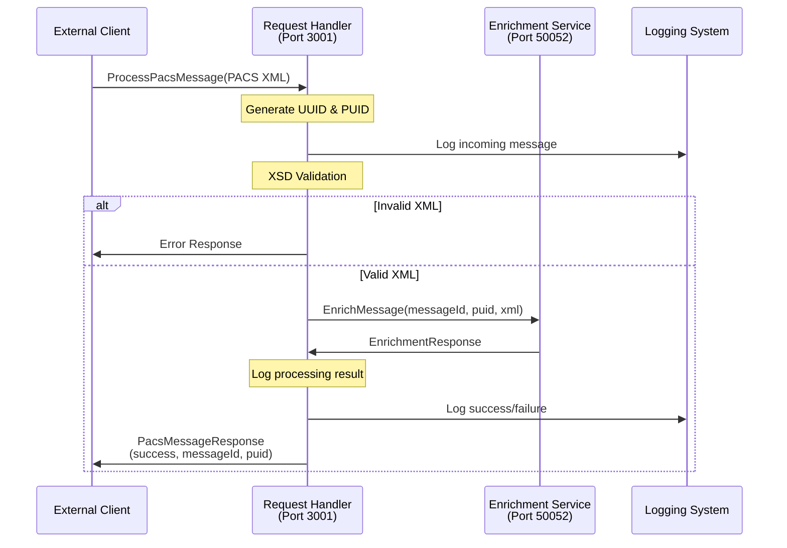

# Fast Request Handler Service

A gRPC-based microservice that serves as the entry point for PACS message processing in the GPP G3 initiative. This service handles incoming PACS messages, performs initial validation, generates unique identifiers, and forwards messages to the enrichment service.

## 🚀 Current Implementation Status: **COMPLETED**

### ✅ Features Implemented
- **gRPC Server**: Handles incoming PACS messages via gRPC
- **Message Processing**: Processes PACS008, PACS007, and PACS003 messages
- **UUID/PUID Generation**: Generates unique identifiers for message tracking
- **XSD Validation**: Validates incoming XML against PACS schemas
- **Singapore Support**: SGD currency, SG country codes, timezone handling
- **Health Check**: Service health monitoring via gRPC
- **Error Handling**: Comprehensive error handling and logging

### 🔧 Technology Stack
- **Runtime**: Node.js with TypeScript
- **Framework**: gRPC with @grpc/grpc-js
- **Port**: 3001 (gRPC), 50051 (Internal gRPC)
- **Testing**: Playwright with PW-Core integration

## 📋 Service Details

### gRPC Service Definition
```protobuf
service PacsHandler {
  rpc ProcessPacsMessage(PacsMessageRequest) returns (PacsMessageResponse);
  rpc GetMessageStatus(MessageStatusRequest) returns (MessageStatusResponse);
  rpc HealthCheck(HealthCheckRequest) returns (HealthCheckResponse);
}
```

### Supported Message Types
- **PACS008**: Customer Credit Transfer
- **PACS007**: Payment Reversal
- **PACS003**: Direct Debit

## 🧪 Running Playwright Tests

### Prerequisites
```bash
# Install dependencies
npm install

# Install Playwright browsers
npx playwright install
```

### Test Commands
```bash
# Run all tests
npm test

# Run tests with UI
npm run test:headed

# Run tests in debug mode
npm run test:debug

# Run specific test file
npx playwright test tests/pw-core-integration.spec.ts

# Run with detailed output
npx playwright test --reporter=line
```

### Test Configuration
The service uses **PW-Core** for standardized testing:
- **ServiceTestHelper**: Manages gRPC connections and test lifecycle
- **SingaporeFixtures**: Pre-built PACS message fixtures
- **SingaporeAssertions**: Singapore-specific validations

### Sample Test
```typescript
import { test, expect } from '@playwright/test';
import { ServiceTestHelper, SingaporeFixtures } from '@gpp/pw-core';

test.describe('Fast Request Handler Service', () => {
  let testHelper: ServiceTestHelper;

  test.beforeAll(async () => {
    testHelper = new ServiceTestHelper('fast-requesthandler-service');
    await testHelper.initialize();
  });

  test('should process PACS008 message', async () => {
    const message = SingaporeFixtures.loadPacs008();
    const response = await testHelper.processMessage(message);
    
    expect(response.success).toBe(true);
    expect(response.messageId).toBeDefined();
    expect(response.puid).toBeDefined();
  });
});
```

## 📊 Service Flow Diagram



## 🔄 Message Processing Flow

1. **Receive Message**: Client sends PACS XML via gRPC
2. **Generate IDs**: Create unique UUID and PUID for tracking
3. **Validate XML**: Perform XSD validation against PACS schema
4. **Forward to Enrichment**: Send to enrichment service for account lookup
5. **Return Response**: Send response back to client with tracking IDs

## 🛠️ Development Setup

### Environment Variables
```bash
# Service Configuration
GRPC_PORT=50051
PUBLIC_PORT=3001
LOG_LEVEL=info

# Singapore Market Configuration
DEFAULT_CURRENCY=SGD
DEFAULT_COUNTRY=SG
TIMEZONE=Asia/Singapore
```

### Running the Service
```bash
# Development mode
npm run dev

# Production mode
npm run build
npm start
```

### Health Check
```bash
# Check service health
grpcurl -plaintext localhost:50051 gpp.g3.requesthandler.MessageHandler/HealthCheck
```

## 📁 Project Structure

```
fast-requesthandler-service/
├── src/
│   ├── grpc/
│   │   ├── server.ts                 # gRPC server setup
│   │   └── handlers/
│   │       └── pacsHandler.ts        # Main message processing
│   ├── services/
│   │   ├── xmlValidator.ts           # XSD validation
│   │   ├── messageProcessor.ts       # Message processing logic
│   │   └── enrichmentClient.ts       # Client for enrichment service
│   ├── utils/
│   │   ├── idGenerator.ts            # UUID/PUID generation
│   │   ├── logger.ts                 # Structured logging
│   │   └── xmlParser.ts              # XML utilities
│   └── index.ts                      # Entry point
├── proto/
│   └── message_handler.proto         # gRPC service definition
├── tests/
│   └── pw-core-integration.spec.ts   # Playwright tests
└── fixtures/
    └── singapore/                    # Test fixtures
```

## 🔍 Monitoring & Observability

### Health Endpoints
- **gRPC Health Check**: Available via gRPC HealthCheck method
- **Service Status**: Returns service name, version, and health status

### Logging
- **Structured Logging**: JSON format with correlation IDs
- **Request Tracing**: Full request/response logging
- **Error Tracking**: Detailed error logging with stack traces

### Metrics
- **Message Processing**: Success/failure rates
- **Response Times**: Processing duration metrics
- **Error Rates**: Error categorization and counts

## 🚨 Error Handling

### Error Categories
- **Validation Errors**: Invalid XML format or schema violations
- **Service Errors**: Downstream service failures
- **System Errors**: Infrastructure or configuration issues

### Error Response Format
```json
{
  "success": false,
  "errorCode": "VALIDATION_ERROR",
  "errorMessage": "Invalid PACS XML format",
  "messageId": "uuid-here",
  "timestamp": "2025-01-10T10:30:00Z"
}
```

## 🔗 Integration Points

### Downstream Services
- **Fast Enrichment Service**: Forwards processed messages for account lookup
- **Logging System**: Structured logging for audit trails

### Protocol Buffers
- **Location**: `proto/message_handler.proto`
- **Generation**: `npm run proto:generate`

## 📝 Testing Strategy

### Unit Tests
- Message processing logic
- XML validation
- ID generation
- Error handling

### Integration Tests
- gRPC service endpoints
- Downstream service communication
- End-to-end message flow

### Performance Tests
- Message throughput
- Response time benchmarks
- Concurrent request handling

## 🎯 Singapore Market Support

### Supported Features
- **Currency**: SGD (Singapore Dollar)
- **Country Codes**: SG (Singapore)
- **Timezone**: Asia/Singapore (+08:00)
- **Bank Codes**: Singapore bank BIC codes (DBSSSGSG, OCBCSGSG, etc.)

### Test Data
- Pre-configured Singapore test accounts
- Sample PACS messages with SGD currency
- Singapore-specific validation rules

---

## 📚 Additional Resources

- [PACS Message Standards](https://www.iso20022.org/)
- [gRPC Documentation](https://grpc.io/docs/)
- [Playwright Testing Guide](https://playwright.dev/docs/intro)
- [PW-Core Testing Framework](../pw-core/README.md) 