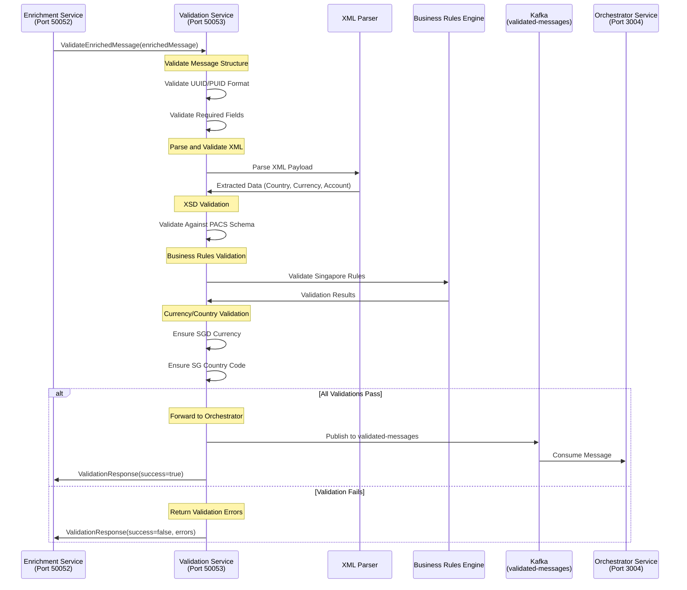

# Fast Validation Service

A gRPC-based microservice that performs comprehensive validation of enriched PACS messages. This service validates XML structure, business rules, and Singapore-specific requirements before forwarding messages to the orchestrator service via Kafka.

## 🚀 Current Implementation Status: **COMPLETED**

### ✅ Features Implemented
- **gRPC Server**: Handles validation requests via gRPC
- **XSD Validation**: Validates XML against PACS schemas
- **Business Rule Validation**: Implements Singapore-specific business rules
- **Multi-Message Support**: Validates PACS008, PACS007, and PACS003 messages
- **Enhanced XML Parser**: Supports multiple PACS message types and structures
- **UUID Format Validation**: Validates message IDs and PUIDs
- **Currency/Country Validation**: Ensures SGD currency and SG country codes
- **Kafka Integration**: Forwards validated messages to orchestrator service
- **Health Check**: Service health monitoring via gRPC

### 🔧 Technology Stack
- **Runtime**: Node.js with TypeScript
- **Framework**: gRPC with @grpc/grpc-js
- **Port**: 50053 (gRPC)
- **Testing**: Playwright with PW-Core integration
- **Message Queue**: Kafka for message forwarding

## 📋 Service Details

### gRPC Service Definition
```protobuf
service ValidationService {
  rpc ValidateEnrichedMessage(ValidationRequest) returns (ValidationResponse);
  rpc HealthCheck(HealthCheckRequest) returns (HealthCheckResponse);
}
```

### Validation Request Structure
```protobuf
message ValidationRequest {
  string message_id = 1;
  string puid = 2;
  string message_type = 3;
  string xml_payload = 4;
  EnrichmentData enrichment_data = 5;
  map<string, string> metadata = 6;
  int64 timestamp = 7;
}
```

## 🧪 Running Playwright Tests

### Prerequisites
```bash
# Install dependencies
npm install

# Install Playwright browsers
npx playwright install
```

### Test Commands
```bash
# Run all tests
npm test

# Run tests with UI
npm run test:headed

# Run tests in debug mode
npm run test:debug

# Run specific test file
npx playwright test tests/pw-core-integration.spec.ts

# Run with detailed output
npx playwright test --reporter=line
```

### Test Configuration
The service uses **PW-Core** for standardized testing:
- **ServiceTestHelper**: Manages gRPC connections and test lifecycle
- **Custom ValidationRequest**: Uses `ValidateEnrichedMessage` gRPC method
- **Singapore Test Data**: Pre-configured test messages and accounts

### Sample Test
```typescript
import { test, expect } from '@playwright/test';
import { ServiceTestHelper, GenericAssertions } from '@gpp/pw-core';

test.describe('Fast Validation Service', () => {
  let testHelper: ServiceTestHelper;

  test.beforeAll(async () => {
    testHelper = new ServiceTestHelper('fast-validation-service', {
      protoPath: 'proto/validation_service.proto',
      serviceUrl: 'localhost:50053'
    });
    await testHelper.initialize();
  });

  test('should validate PACS008 message', async () => {
    const validationRequest = {
      messageId: '550e8400-e29b-41d4-a716-446655440000',
      puid: 'G3I1234567890123',
      messageType: 'PACS008',
      xmlPayload: SINGAPORE_PACS_MESSAGES.PACS008,
      enrichmentData: mockEnrichmentData
    };

    const response = await testHelper.callGrpcMethod(
      'ValidateEnrichedMessage', 
      validationRequest
    );
    
    expect(response.success).toBe(true);
    expect(response.validationResult.isValid).toBe(true);
  });
});
```

## 📊 Service Flow Diagram



## 🔄 Validation Process Flow

1. **Message Reception**: Receive enriched message from enrichment service
2. **Structure Validation**: Validate UUID/PUID format and required fields
3. **XML Parsing**: Extract and parse XML payload for all message types
4. **XSD Validation**: Validate XML against PACS schema definitions
5. **Business Rules**: Apply Singapore-specific business rules
6. **Currency/Country Check**: Ensure SGD currency and SG country codes
7. **Success Path**: Forward validated message to orchestrator via Kafka
8. **Error Path**: Return detailed validation errors to caller

## 🛠️ Development Setup

### Environment Variables
```bash
# Service Configuration
GRPC_PORT=50053
LOG_LEVEL=info

# Kafka Configuration
KAFKA_BROKERS=localhost:9092
KAFKA_TOPIC=validated-messages
KAFKA_GROUP_ID=validation-service-group

# Validation Configuration
VALIDATE_XSD=true
VALIDATE_BUSINESS_RULES=true
REQUIRE_ENRICHMENT_DATA=true
```

### Running the Service
```bash
# Development mode
npm run dev

# Production mode
npm run build
npm start
```

### Health Check
```bash
# Check service health
grpcurl -plaintext localhost:50053 gpp.g3.validation.ValidationService/HealthCheck
```

## 📁 Project Structure

```
fast-validation-service/
├── src/
│   ├── grpc/
│   │   ├── server.ts                 # gRPC server setup
│   │   └── handlers/
│   │       └── validationHandler.ts  # Main validation logic
│   ├── services/
│   │   ├── xmlValidator.ts           # XSD validation
│   │   ├── businessRulesValidator.ts # Business rules validation
│   │   └── kafkaProducer.ts          # Kafka message publishing
│   ├── utils/
│   │   ├── xmlParser.ts              # Enhanced XML parsing
│   │   ├── messageIdValidator.ts     # UUID/PUID validation
│   │   └── logger.ts                 # Structured logging
│   └── index.ts                      # Entry point
├── proto/
│   └── validation_service.proto      # gRPC service definition
├── tests/
│   ├── pw-core-integration.spec.ts   # Playwright tests
│   └── fixtures/
│       └── singapore/                # Test fixtures
└── schemas/
    └── pacs/                         # PACS XSD schemas
```

## 🔍 Enhanced XML Parser

### Multi-Message Type Support
The validation service supports all PACS message types with enhanced path detection:

```typescript
const XML_PATHS = {
  PACS008: {
    country: 'FIToFICstmrCdtTrf.CdtTrfTxInf.Cdtr.PstlAdr.Ctry',
    currency: 'FIToFICstmrCdtTrf.CdtTrfTxInf.IntrBkSttlmAmt.@Ccy',
    account: 'FIToFICstmrCdtTrf.CdtTrfTxInf.CdtrAcct.Id.Othr.Id'
  },
  PACS007: {
    country: 'FIToFIPmtRvsl.TxInf.OrgnlTxRef.Cdtr.PstlAdr.Ctry',
    currency: 'FIToFIPmtRvsl.TxInf.OrgnlTxRef.IntrBkSttlmAmt.@Ccy',
    account: 'FIToFIPmtRvsl.TxInf.OrgnlTxRef.CdtrAcct.Id.Othr.Id'
  },
  PACS003: {
    country: 'FIToFICstmrDrctDbt.DrctDbtTxInf.Cdtr.PstlAdr.Ctry',
    currency: 'FIToFICstmrDrctDbt.DrctDbtTxInf.IntrBkSttlmAmt.@Ccy',
    account: 'FIToFICstmrDrctDbt.DrctDbtTxInf.CdtrAcct.Id.Othr.Id'
  }
};
```

### Validation Rules
- **Currency Validation**: Must be 'SGD' for Singapore market
- **Country Validation**: Must be 'SG' for Singapore market
- **Account Validation**: Must be valid Singapore account format
- **UUID Validation**: Standard UUID v4 format
- **PUID Validation**: G3I prefix followed by 13 alphanumeric characters

## 🧪 Test Data and Fixtures

### Singapore Test Messages
```typescript
export const SINGAPORE_PACS_MESSAGES = {
  PACS008: '<?xml version="1.0" encoding="UTF-8"?>...',
  PACS007: '<?xml version="1.0" encoding="UTF-8"?>...',
  PACS003: '<?xml version="1.0" encoding="UTF-8"?>...'
};
```

### Test Accounts
```typescript
export const SINGAPORE_TEST_ACCOUNTS = {
  STANDARD_RETAIL: {
    accountId: '123456789012',
    expectedAuthMethod: 'AFPONLY',
    expectedSystem: 'MDZ'
  },
  VAM_ACCOUNT: {
    accountId: '999888777666',
    expectedAuthMethod: 'GROUPLIMIT',
    expectedSystem: 'VAM'
  }
};
```

## 🚨 Error Handling

### Validation Error Types
- **XML_INVALID**: Malformed XML or schema validation failure
- **BUSINESS_RULE_VIOLATION**: Singapore business rule violations
- **CURRENCY_INVALID**: Currency is not SGD
- **COUNTRY_INVALID**: Country is not SG
- **UUID_INVALID**: Invalid UUID format
- **PUID_INVALID**: Invalid PUID format
- **ENRICHMENT_MISSING**: Required enrichment data missing

### Error Response Format
```json
{
  "success": false,
  "validationResult": {
    "isValid": false,
    "validationErrors": [
      {
        "code": "CURRENCY_INVALID",
        "message": "Currency must be SGD for Singapore market",
        "field": "IntrBkSttlmAmt.Ccy"
      }
    ]
  }
}
```

## 📊 Kafka Integration

### Message Publishing
Validated messages are published to the `validated-messages` Kafka topic:

```typescript
const kafkaMessage = {
  messageId: validationRequest.messageId,
  puid: validationRequest.puid,
  messageType: validationRequest.messageType,
  jsonPayload: JSON.stringify(parsedXml),
  enrichmentData: validationRequest.enrichmentData,
  validationResult: {
    isValid: true,
    validationErrors: []
  },
  timestamp: Date.now()
};
```

### Topic Configuration
- **Topic**: `validated-messages`
- **Partitions**: Based on message ID for ordered processing
- **Retention**: 24 hours for processing guarantees

## 🎯 Singapore Market Support

### Business Rules
- **SGD Currency**: All transactions must be in Singapore Dollars
- **SG Country Code**: All addresses must be Singapore-based
- **Bank Code Validation**: Must use valid Singapore bank BIC codes
- **Account Format**: Must match Singapore account number patterns

### Supported Message Types
- **PACS008**: Customer Credit Transfer (most common)
- **PACS007**: Payment Reversal
- **PACS003**: Direct Debit

---

## 📚 Additional Resources

- [PACS Message Standards](https://www.iso20022.org/)
- [Kafka Integration Guide](https://kafka.apache.org/documentation/)
- [Singapore Banking Standards](https://www.mas.gov.sg/)
- [PW-Core Testing Framework](../pw-core/README.md) 